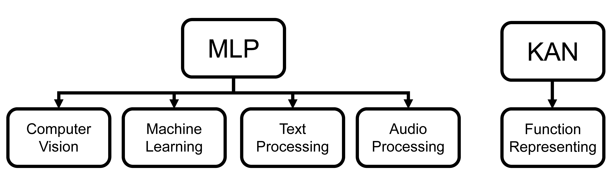

# KANbeFair

*A More Fair and Comprehensive Comparision between KAN and MLP*

TL;DR - For Function Representing, use KAN; for Computer Vision, Machine Learning, Text Processing, and Audio Processing Tasks, use MLP.

## Contents
- [Install](#install)
- [Run](#run)

## Install
Our code is tested with CUDA 12.2. Experiment environment can be built from the `yml` file.
```sh
cd KANbeFair
conda env create -f environment.yml
```

## Run
To run the code using the following commands.
```sh
cd src

python train.py \
    --model KAN \ # or MLP, to sepcify the model architecture
    --layers_width 10 10 \ # The hidden layer widths. e.g, for MLP on MNIST, this leads to a model with Linear(28*28,10) -> Linear(10,10) -> Linear(10,10); for KAN on MNIST, this leads to kan.KAN(width = (28*28,10,10,10))
    --dataset MNIST \ 
    --batch-size 128 \
    --epochs 20 \
    --lr 0.001 \
    --seed 1314 \
    --activation_name gelu \ # Only for MLP, the activation function
    --kan_bspline_grid 20 \ # Only for KAN, the number of spline grid
    --kan_bspline_order 5 \ # Only for KAN, the order of spline
    --kan_grid_range -4 4 \ # Only for KAN, the domain of spline
```

## Citation

If you find KANbeFair useful, please cite using this BibTeX:
```bibtex
@misc{,
      title={}, 
      author={Runpeng Yu and Weihao Yu and Xinchao Wang},
      year={2024},
      eprint={},
      archivePrefix={arXiv},
      primaryClass={cs.CV},
      url={https://arxiv.org/abs/2407.}, 
}
```

## Acknowledgement

- [pykan](https://github.com/KindXiaoming/pykan/tree/master): We would like to thank the author for their nice work and codebase.
