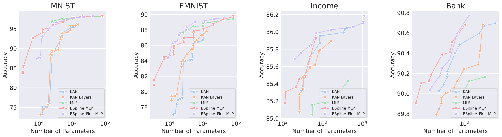

# KANbeFair

*A More Fair and Comprehensive Comparison between KAN and MLP*

[[Paper](https://arxiv.org/abs/2407.16674)]

TL;DR (1) - For Symbolic Formula Representing, use KAN; for Computer Vision, Machine Learning, Text Processing, and Audio Processing Tasks, use MLP.


TL;DR (2) - By ablating the network architecture of KAN and MLP, the primary advantage of KAN lies in the use of Bspline functions. Replacing the activation functions in MLP with Bspline allows MLP to outperform KAN on datasets where KAN previously had the upper hand.


## Contents
- [Install](#install)
- [Run](#run)
- [Number of Parameters and FLOPs](#number_of_parameters_and_flops)

## Install
Our code is tested with CUDA 12.2. Experiment environment can be built from the `yml` file.
```sh
cd KANbeFair
conda env create -f environment.yml
```

## Run
To run the code using the following commands.
```sh
cd src

python train.py \
    --model KAN \ # or MLP, to sepcify the model architecture
    --layers_width 10 10 \ # The hidden layer widths. e.g, for MLP on MNIST, this leads to a model with Linear(28*28,10) -> Linear(10,10) -> Linear(10,10); for KAN on MNIST, this leads to kan.KAN(width = (28*28,10,10,10))
    --dataset MNIST \ 
    --batch-size 128 \
    --epochs 20 \
    --lr 0.001 \
    --seed 1314 \
    --activation_name gelu \ # Only for MLP, the activation function
    --kan_bspline_grid 20 \ # Only for KAN, the number of spline grid
    --kan_bspline_order 5 \ # Only for KAN, the order of spline
    --kan_grid_range -4 4 \ # Only for KAN, the domain of spline
```
## Number of Parameters and FLOPs
We have two instance methods for each of KAN, MLP and MLP with B-spline activation to calculate its Number of parameters and FLOPs.

```python
import torch
from argparse import Namespace

from models.mlp import *
from models.kanbefair import *
from models.bspline_mlp import *

# Instantiate a KANbeFair network.
args_KAN = Namespace(**{
    "input_size":28*28,
    "layers_width":[10,10],
    "output_size":10,
    "kan_bspline_grid":20,
    "kan_bspline_order":5,
    "kan_shortcut_function":torch.nn.SiLU(),
    "kan_grid_range":[-1,1]
    })
model_KAN = KANbeFair(args_KAN)
# print number of parameters and FLOPs of KAN.
num_parameters_KAN = model_KAN.total_parameters()
flops_KAN = model_KAN.total_flops()
print(f"KAN: Number of parameters: {num_parameters_KAN:,}; Number of FLOPs: {flops_KAN:,}")

# Instantiate a MLP network.
args_MLP = Namespace(**{
    "input_size":28*28,
    "layers_width":[10,10],
    "output_size":10,
    "batch_norm": False,
    "activation":torch.nn.ReLU
    })
model_MLP = MLP(args_MLP)
# print number of parameters and FLOPs of MLP.
num_parameters_MLP = model_MLP.total_parameters()
flops_MLP = model_MLP.total_flops()
print(f"MLP: Number of parameters: {num_parameters_MLP:,}; Number of FLOPs: {flops_MLP:,}")
```

## Citation

If you find KANbeFair useful, please cite using this BibTeX:
```bibtex
@misc{yu2024kanbefair,
      title={KAN or MLP: A Fairer Comparison}, 
      author={Runpeng Yu and Weihao Yu and Xinchao Wang},
      year={2024},
      eprint={2407.16674},
      archivePrefix={arXiv},
      primaryClass={cs.LG},
      url={https://arxiv.org/abs/2407.16674}, 
}
```

## Acknowledgement

- [pykan](https://github.com/KindXiaoming/pykan/tree/master): We would like to thank the author for their nice work and codebase.
